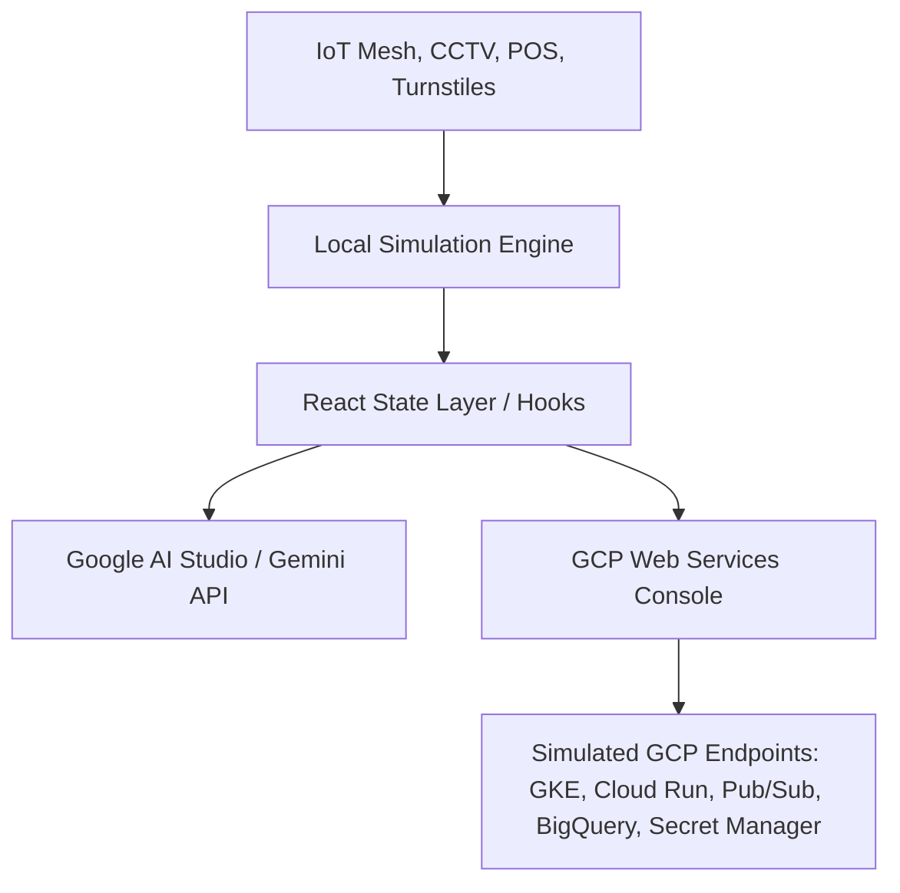

# Architecture Document

## 1. Overview

This document describes the high-level architecture for **StadiumOps Pro - Smart Stadium Operations & Revenue Monitor Hub**. The solution is engineered as a highly responsive, client-first React application (Vite + React 19 + Tailwind CSS) designed for serverless container deployment on **Google Cloud Run**.

To ensure seamless, standalone operation and high accessibility within the AI Studio preview environment, all core stadium operations pipelines (IoT meshes, ticketing gates, computer vision, concessions POS, and staffing dispatches) are orchestrated using a robust **Local Reactive Simulation Engine**. This engine simulates real-time data ingestion and processing with high fidelity, while a dedicated **GCP Web Services Architecture Panel** provides active visual diagnostics, ping tests, and terminal outputs representing actual Google Cloud integrations.

---

## 2. System Architecture & Component Mapping

The application maps critical stadium operations to a modern web client and simulated cloud services:

### 2.1. Local Simulation Engine (Frontend Core)
- **High-Frequency Ingestion Simulators:** Simulates ticket scans across 4 gates, cash register tallies across 24 concessions, and live camera feed frames.
- **State Synchronizers:** Updates local state and maps dynamic crowd congestion bottlenecks, revenue leakage warnings, and event staffing dispatches reactively.

### 2.2. GCP Web Services Integration Panel
A fully interactive diagnostics suite representing a production Google Cloud topology. Stadium operators can ping and run self-test health queries on 15 core services:
- **Compute:** GKE, Cloud Run, Cloud Functions.
- **AI & ML:** Vertex AI, Cloud Vision API, MediaPipe.
- **Data & IoT:** BigQuery, Pub/Sub, Cloud Dataflow.
- **Databases & Storage:** Cloud SQL, Cloud Firestore, GCS.
- **Engagement:** Google Maps Platform, Firebase Cloud Messaging, Firebase Auth.
- **Analytics:** Looker Analytics.

### 2.3. Serverless Gemini AI Integration
Provides real-time natural language summaries, automated steward staffing dispatches, and crowd bottleneck optimization advisories using Vertex AI/Gemini endpoints.

---

## 3. Deployment & Security Guidelines

### 3.1. Standalone Deployment
The app is fully compatible with production builds (`npm run build`) and starts instantly in any standard Node.js server container (such as Google Cloud Run).

### 3.2. Secure Configuration Management
To prevent client-side credential leaks:
- Sensitive variables (such as operational API keys) are configured through a safe environment interface.
- For production GCP environments, variables are stored in **Google Secret Manager** and injected into the execution container securely at runtime, avoiding `VITE_` prefix leaks in public codebases.
