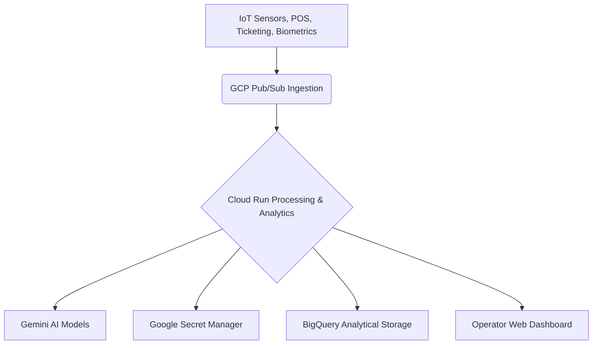

# Architecture Document

## 1. Overview

This document describes the high-level architecture for the Smart Stadium Digital Assistant. The solution is built as a modular, scalable, and secure system, leveraging Google Cloud Platform (GCP) technologies, cloud-native principles, and microservices. The architecture is designed to support real-time data processing for dynamic pricing, smart building IoT telemetry, and interactive fan engagement.

## 2. High-Level System Architecture

The system consists of several interconnected components deployed on GCP:

*   **GCP IoT Core / Pub/Sub Data Ingestion Layer:** Responsible for collecting data from stadium IoT sensors, ticketing gates, concession POS registers, and computer vision feeds.
*   **Data Processing & Analytics Layer (Cloud Run / BigQuery):** Runs serverless container endpoints on **Google Cloud Run** to execute predictive crowd analytics, dynamic ticket pricing, and computer-vision processing. Historical logs are synchronized with **Google BigQuery** for analytics.
*   **Security & Configuration Layer (Google Secret Manager):** Sensitive operational API keys (e.g., `VITE_STADIUM_OPS_API_KEY`, `VITE_GEMINI_API_KEY`) and system identifiers are securely stored in **Google Secret Manager**, avoiding source code leakage.
*   **Frontend Applications Layer:** Visually polished, responsive React web-based dashboards for stadium operators and event planners.

## 3. Technical Stack (GCP-Enhanced)

The following technologies are integrated to build the Smart Stadium Digital Assistant:

### 3.1. Ingestion & Storage
*   **GCP Pub/Sub:** Real-time event broker handling massive streams of turnstile ticket scans and concession POS orders.
*   **Google BigQuery:** Enterprise data warehouse storing unified history for security, staffing, and revenue auditing.
*   **Google Secret Manager:** Secure secret vault for system API keys and credentials.

### 3.2. Hosting & Hosting
*   **Google Cloud Run:** Serverless container platform hosting the application backend, ensuring automated scaling, low cold starts, and cost-efficiency.

### 3.3. AI/ML
*   **Gemini Pro Model (Google AI Studio / Vertex AI):** Powers live operational insights, automated staff allocation suggestions, and natural language analytics.
